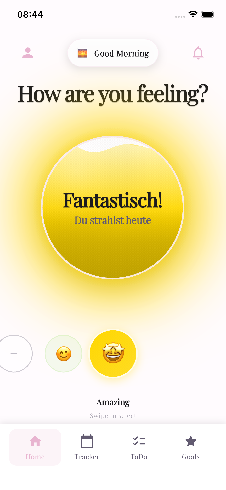
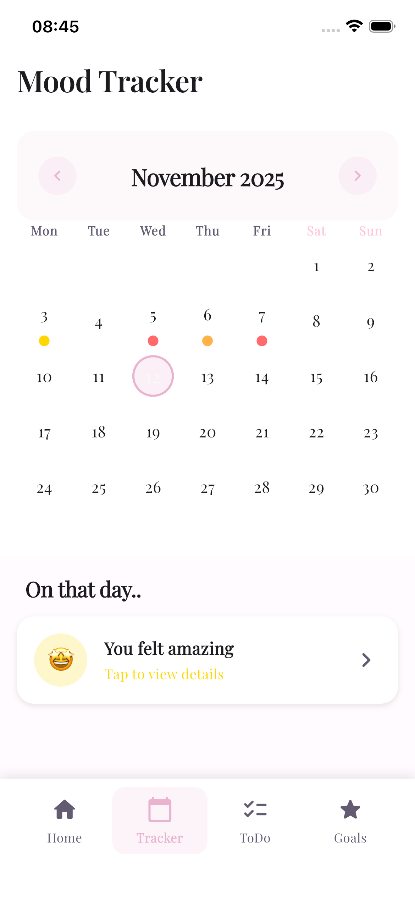
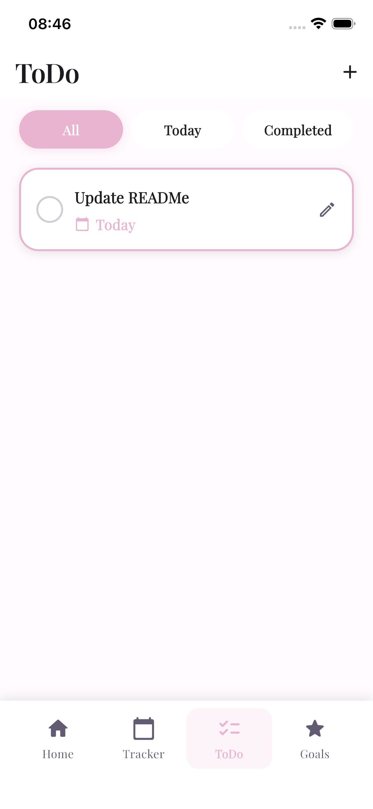
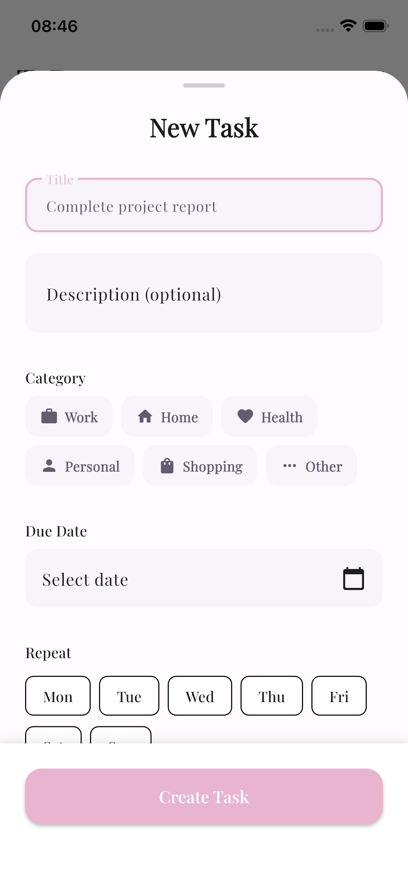
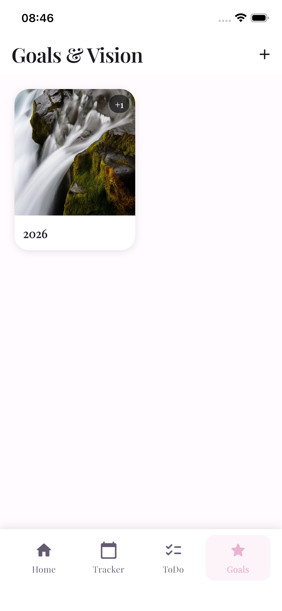

# Miui - Mood Tracking & Wellness App

A beautiful iOS app designed to help you track your mood, manage tasks, and reflect on your emotional wellbeing through an elegant and intuitive interface.

## Screenshots

<p align="center">
  
  
  
</p>

<p align="center">
  
  
  
</p>

## Features

### 🏠 Home
- Daily mood selection with liquid-fill animation
- Interactive mood carousel with 5 mood levels
- View today's mood entries at a glance
- Personalized mood messages
- Smooth animations and visual feedback

### 📊 Tracker
- Calendar view showing mood history with colored indicators
- Mini mood circles under each day
- View all mood entries for selected days
- Tap to view detailed mood information
- Track emotional patterns over time

### ✅ ToDo
- Create and manage tasks with categories (Work, Home, Health, Personal, Shopping, Other)
- Filter tasks by All, Today, or Completed
- Due date tracking with overdue indicators
- Swipe to delete tasks
- Liquid-fill checkbox animation on completion
- 3-second animation before moving to completed

### 📝 Notes
- **Journal**: Capture daily thoughts and experiences
- **Affirmations**: Write positive affirmations for self-love
- Quick access to your personal reflections

### ⭐ Goals & Visionboards
- Create visual visionboards for your dreams
- Add multiple images to each visionboard
- Organize and visualize your long-term goals
- Beautiful grid layout with image previews

## Tech Stack

- **Flutter 3.35.7**
- **Dart 3.9.2**
- **State Management**: Provider
- **Local Storage**: Hive
- **Notifications**: flutter_local_notifications
- **UI**: Material Design 3 with custom theme
- **Typography**: Google Fonts (Poppins, Playfair Display)

## Getting Started

### Prerequisites
- Flutter SDK 3.0.0 or higher
- Xcode (for iOS development)
- iOS Simulator or physical iOS device

### Installation

1. Clone the repository
```bash
git clone https://github.com/wwebpy/miuigirlsApp-Flutter.git
```

2. Install dependencies:
```bash
flutter pub get
```

3. Generate Hive adapters:
```bash
flutter packages pub run build_runner build
```

4. Run the app:
```bash
flutter run
```

## Design Philosophy

The app is designed with a clean, modern aesthetic:
- Smooth liquid-fill animations
- Intuitive gesture controls
- Color-coded mood indicators
- Clean UI with rounded corners
- Responsive feedback and transitions

## Target Audience

Users seeking:
- Daily mood tracking and reflection
- Task management with visual feedback
- Emotional pattern recognition
- Personal development tools
- Mental wellness and self-care

---

Created with 💜
